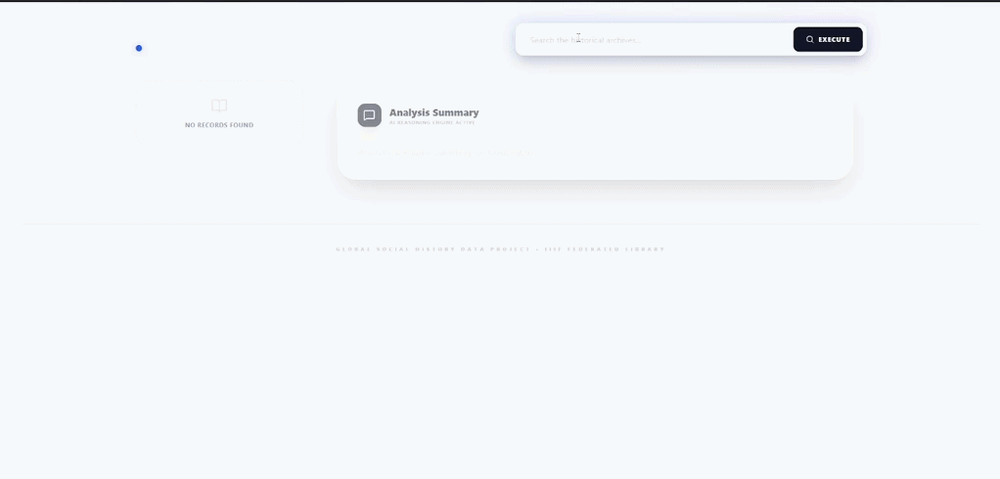
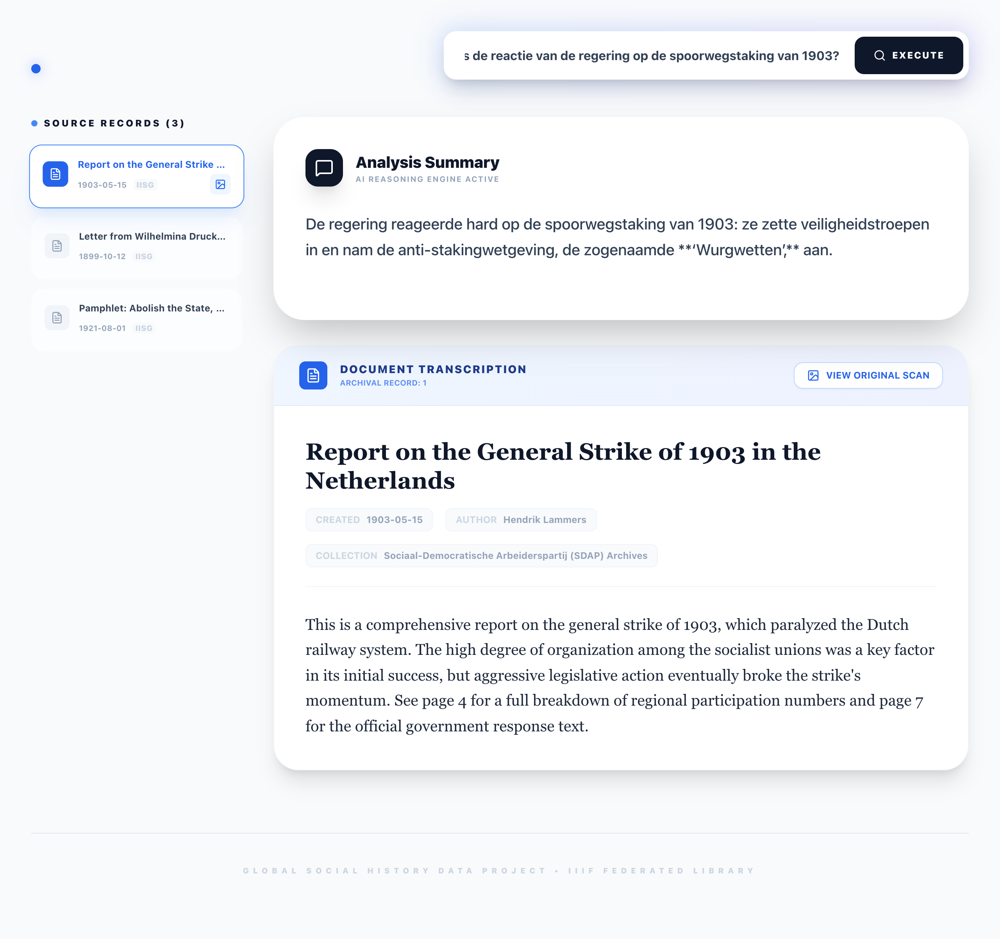
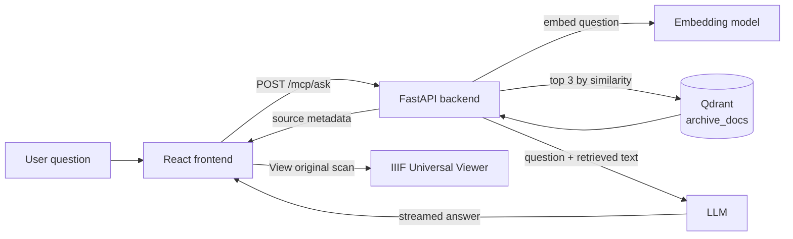

# Archive MCP

A historical archives search and RAG (Retrieval-Augmented Generation) tool. Users can search digitised historical documents and ask natural-language questions answered by an LLM grounded in the archive content. Every answer comes with the source records it was based on, so you can check the answer against the documents themselves.



*Ask a question, watch the answer stream in, then open one of the source records it was based on.*



*A Dutch question over English-language records. The answer is in the centre; the three retrieved source records are on the left. Clicking a record opens its transcription and metadata below the answer, with a link to the original scan.*

## What it does

- **Ask in Dutch or English.** The question is embedded, the closest archive records are retrieved, and the LLM answers from the retrieved text. The embedding model is multilingual, so a Dutch question finds English records; in the screenshot the model also answered in Dutch, though the prompt doesn't require it.
- **See where the answer came from.** The UI lists every source record used for the answer, with its date, creator, collection and persistent handle.
- **Check the original.** Each record opens its full transcription, and "View original scan" opens the IIIF manifest in the Universal Viewer.
- **Stay inside the sources.** The system prompt tells the model not to use outside knowledge, and to say so when the retrieved documents don't contain the answer. This is an instruction to the model, not a guarantee.

## How it works



`/mcp/ask` streams the answer text first. Once the answer is complete, it appends the source metadata after a `$$DOCS_METADATA$$` marker, and the frontend splits the stream at that marker into the answer panel and the source list.

A source record as returned by `/mcp/search`:

```json
{
  "id": "2",
  "title": "Letter from Wilhelmina Drucker to Aletta Jacobs regarding Suffrage",
  "excerpt": "This personal correspondence from 1899 discusses strategies …",
  "iiif_id": "N10656132",
  "institute_code": "10622",
  "handle": "https://hdl.handle.net/10622/N10656132",
  "date_created": "1899-10-12",
  "collection": "Feminist Pioneers Correspondence",
  "creator": "Wilhelmina Drucker",
  "viewer_url": "https://access.iisg.amsterdam/uv.html#?manifest=https://access.iisg.amsterdam/iiif/presentation/N10656132&c=0&m=0&cv=0",
  "full_text": "Dearest Aletta, I write to you today with urgency. The curre…"
}
```

## Current limitations

- **Citations are per answer, not per sentence.** The UI shows which records were retrieved, but the answer text has no inline markers, so you can't tell which sentence came from which record.
- **Only 3 records are retrieved.** The limit is fixed in `/mcp/search`.
- **The example data is illustrative.** The three records in `archive_mcp/data/` are short placeholder texts written for the demo. They all point to the same IISG handle and IIIF manifest.
- **Ingest takes JSON, not PDFs.** Documents must already be transcribed into the JSON format below.
- **The embedded scan viewer link is currently broken.** The IISG Universal Viewer path used for `viewer_url` returns 404; the IIIF manifests themselves still resolve.
- **Markdown in answers isn't rendered.** If the model uses bold, the `**` shows up as literal characters.
- **Not fully local.** Embeddings and chat completions go through an external OpenAI-compatible API (SURF's willma). Any OpenAI-compatible endpoint, including a local one, can be set in `.env`.

## Architecture

| Component | Description |
|-----------|-------------|
| `archive_mcp/` | FastAPI backend — MCP server exposing `/mcp/search` and `/mcp/ask` |
| `archive-frontend/` | React frontend UI |
| Qdrant | Vector database storing document embeddings |
| External LLM API | willma.surf.nl — used for both embeddings and chat completions |

**Ports:**
- Frontend: `http://localhost:3000`
- Backend API: `http://localhost:8000`
- Qdrant: `http://localhost:6333`

## Prerequisites

- Docker and Docker Compose
- Access to the LLM API (willma.surf.nl) — requires API key

## Setup

### 1. Clone the repository

```bash
git clone https://github.com/Crispsec/Archive-RAG.git
cd Archive-RAG
```

### 2. Create the `.env` file

Copy the example and fill in the real API key:

```bash
cp .env.example .env
```

Edit `.env`:

```env
LLM_BASE_URL=https://willma.surf.nl/api/v0
LLM_API_KEY=<your-api-key>
LLM_MODEL=openai/gpt-oss-120b
EMBEDDING_MODEL=Qwen/Qwen3-Embedding-8B
```

### 3. Build and start the stack

```bash
docker compose up --build -d
```

This starts three containers: `backend`, `frontend`, `qdrant`.

### 4. Ingest documents into Qdrant

This step populates the vector database. It must be run once after first setup, and again whenever documents in `archive_mcp/data/` change.

Run it inside the backend container (which already has the dependencies and correct env vars):

```bash
docker compose exec backend python qdrant_ingest.py
```

Alternatively, run it locally if you have Python and the dependencies installed:

```bash
cd archive_mcp
pip install -r requirements.txt
export $(cat ../.env | xargs)
python qdrant_ingest.py
```

The script will:
- Connect to Qdrant at `localhost:6333`
- Recreate the `archive_docs` collection (deletes existing data)
- Embed and insert all `.json` files from `archive_mcp/data/`

### 5. Verify

```bash
# Check all containers are running
docker compose ps

# Test the backend
curl http://localhost:8000/mcp/manifest

# Test search
curl -X POST http://localhost:8000/mcp/search \
  -H "Content-Type: application/json" \
  -d '{"query": "labour movement"}'
```

Frontend is available at `http://localhost:3000`.

## Adding documents

Place new `.json` files in `archive_mcp/data/`. Each file must follow this structure:

```json
{
  "id": 1,
  "title": "Document title",
  "excerpt": "Short summary used for embedding and display",
  "full_text": "Full transcription of the document",
  "iiif_manifest": "https://access.iisg.amsterdam/iiif/presentation/N10656132/manifest",
  "handle": "https://hdl.handle.net/10622/...",
  "date_created": "1920",
  "collection": "Collection name",
  "creator": "Author or institution"
}
```

After adding files, re-run the ingest step (step 4).

## Stopping

```bash
docker compose down
```

Qdrant data is persisted in a Docker volume (`qdrant_storage`) and survives restarts. To wipe it:

```bash
docker compose down -v
```

## AI assistance

Built with AI assistance (mainly Gemini, plus other providers). The idea and the architecture are mine; the AI tools contributed code for the frontend and backend. Claude helped draft this README.
